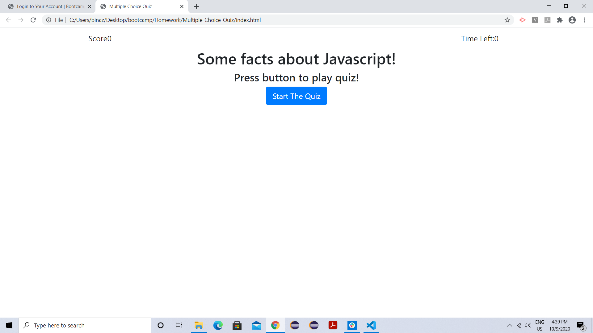
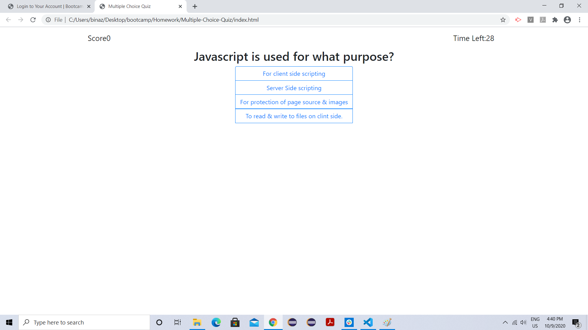
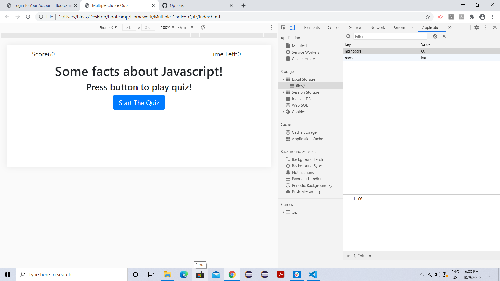

# Multiple-Choice-Quiz
It is a timed multiple choice quiz. In this quiz when user start the quiz timer starts reducing from 30 seconds.
Every question is presented with 4 optional answers out which user has to select 1 answer.
Every correct answer will give 20 points. With every negetive answer there is no deduction from points but time will get reduced by 10 seconds.
If the timer reaches to zero then game will automatically ends and displays the score.
User can save the score in local storage by entering his/her name and score will be saved automatically. If the score is zero then it will not ask user to enter his/her name as score is zero.
when user choose to play again then high score from local storage will be displayed in the place of score and when user finish the game local storage will be updated with the new score. 

# Images
Below are the images of quiz

# Links
Github repo: https://github.com/karimkapadia/Multiple-Choice-Quiz
Live link :  https://karimkapadia.github.io/Multiple-Choice-Quiz/

